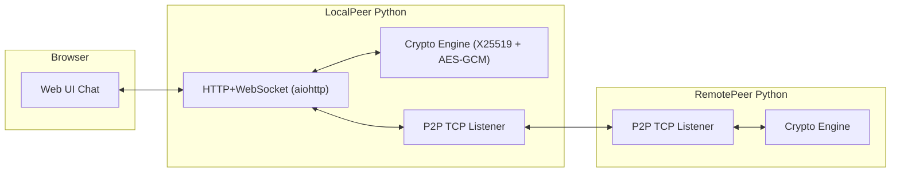

# P2P Chat (End-to-End Encrypted)

Demo aplikasi chat P2P sederhana untuk tugas Sistem Terdistribusi. Tiap peer punya key pair, melakukan handshake public key, lalu memakai session key (HKDF + AES-GCM) untuk enkripsi pesan end-to-end.

## Persyaratan
- Python 3.10+
- Paket: `aiohttp`, `cryptography`

Instal:
```bash
pip install aiohttp cryptography
```

## Menjalankan
1) Jalankan peer A (contoh port P2P 6000, web UI 8000):
```bash
python P2P.py --port 6000 --web-port 8000
```
2) Jalankan peer B (contoh port P2P 6001, web UI 8001, bisa di mesin sama dengan 127.0.0.1):
```bash
python P2P.py --port 6001 --web-port 8001
```
3) Buka UI lokal:
   - Peer A: http://localhost:8000
   - Peer B: http://localhost:8001
4) Di UI, isi display name (opsional), masukkan `IP:Port` lawan (mis. `127.0.0.1` dan `5001`), klik **Connect**.
5) Kirim pesan melalui kotak input. Pesan dikirim terenkripsi setelah handshake selesai.

## Catatan Keamanan
- Session key dibuat dari X25519 + HKDF, pesan disegel AES-GCM.
- Public key ditampilkan di UI (dipotong) sebagai identitas peer.
- Mode discovery manual: user memasukkan IP:Port lawan.

## Struktur Utama
- `P2P.py` — entrypoint, HTTP+WebSocket untuk UI, integrasi P2PNode.
- `p2p_node.py` — listener P2P, handshake public key, enkripsi/dekripsi pesan.
- `crypto_utils.py` — utilitas kriptografi (X25519, HKDF, AES-GCM).
- `static/index.html`, `static/app.js` — UI sederhana.


# Arsitektur & Workflow P2P Encrypted Chat (Python)

Dokumen ini menjelaskan skema, arsitektur, dan alur kerja platform P2P chat yang kamu bangun sebagai tugas Sistem Terdistribusi.

---

## 1. Gambaran Umum Sistem

- **Tujuan**: Chat 1-to-1 antara dua peer, dengan **end-to-end encryption**.
- **Tech stack**:
  - Backend peer: Python (`P2P.py`, `p2p_node.py`, `crypto_utils.py`)
  - UI: HTML + JavaScript (`static/index.html`, `static/app.js`)
  - Komunikasi:
    - Browser ↔ Peer lokal: WebSocket (aiohttp)
    - Peer ↔ Peer: TCP async (asyncio) dengan pesan JSON terenkripsi
- **Identitas user**: Setiap peer memiliki sepasang key X25519 (public/private). Public key menjadi “ID kriptografi” peer.

---

## 2. Arsitektur Tingkat Tinggi



**Alur besar**:
1. Browser terhubung ke peer lokal via WebSocket.
2. User ketik pesan di UI → dikirim ke server lokal.
3. Peer lokal mengenkripsi pesan dan kirim lewat koneksi P2P ke peer lain.
4. Peer remote mendekripsi dan meneruskan pesan ke browser lawan via WebSocket.

---

## 3. Desain Kriptografi

- **Key pair per peer**:
  - Dibuat saat node P2P diinisialisasi (`generate_x25519_keypair` di `crypto_utils.py`).
  - Private key disimpan di memori proses; public key diekspor dalam bentuk base64 untuk handshake & ditampilkan di UI.

- **Handshake & derivasi session key**:
  1. Ketika koneksi TCP terbentuk, kedua peer saling mengirim pesan handshake:
     - `{"type": "handshake", "public_key": "<base64 X25519 public key>"}`.
  2. Masing-masing peer:
     - Mengubah base64 → objek `X25519PublicKey`.
     - Melakukan `private.exchange(peer_public)` → menghasilkan shared secret.
     - Memasukkan shared secret ke HKDF-SHA256 untuk mendapat **session key** 32-byte.
  3. Session key disimpan per-peer (`self.sessions[peer_id]`) dan dipakai untuk semua pesan chat berikutnya.
  4. Mekanisme deduplikasi:
     - Sistem menyimpan peta `pubkey → peer_id`. Jika ada koneksi duplikat dengan public key yang sama, koneksi terbaru ditutup supaya tidak ada pesan dobel.

- **Enkripsi pesan** (AES-GCM):
  - Fungsi `encrypt_payload(key, payload)`:
    - Generate nonce 12 byte secara acak.
    - Serialize payload ke JSON bytes.
    - Enkripsi dengan `AESGCM(key).encrypt(nonce, data, None)`.
    - Bungkus jadi envelope:
      - `{"type": "data", "nonce": "...", "ciphertext": "..."}` (nonce & ciphertext di-base64).
  - Fungsi `decrypt_payload(key, envelope)`:
    - Decode base64 nonce & ciphertext.
    - `AESGCM(key).decrypt(nonce, ciphertext, None)` → JSON bytes → dict Python.

---

## 4. Desain Networking & Discovery

- **Mode**: Pure P2P dengan discovery **manual IP:Port**.
- Tiap peer:
  - Menjalankan listener TCP di `--host` dan `--port` (misal `0.0.0.0:6000`).
  - Menjalankan web UI lokal di `--web-host` dan `--web-port` (misal `127.0.0.1:8000`).
- **Connect ke peer lain**:
  - Di UI, user memasukkan `remote IP` dan `remote port` (mis. `127.0.0.1` & `6001`).
  - Browser mengirim JSON ke WebSocket:
    - `{"action": "connect_peer", "ip": "<IP>", "port": <PORT>}`.
  - Backend membuka koneksi TCP outbound ke peer tersebut dan memulai handshake.

Multi-instance:
- Di satu device bisa menjalankan beberapa peer, asalkan:
  - Port P2P berbeda (6000, 6001, 6002, ...).
  - Port web UI berbeda (8000, 8001, 8002, ...).

---

## 5. Komponen Kode Utama

- **`P2P.py`**:
  - Parse argumen CLI: `--port`, `--web-port`, dll.
  - Membuat instance `P2PNode`.
  - Menjalankan server aiohttp:
    - `GET /` → kirim `static/index.html`.
    - `GET /ws` → WebSocket untuk komunikasi UI.
    - `GET /static/...` → file statis (JS, CSS).
  - Menghubungkan WebSocket dengan node P2P:
    - Aksi `connect_peer` → panggil `P2PNode.connect`.
    - Aksi `send_message` → `P2PNode.broadcast` dengan payload pesan.
    - Pesan masuk dari P2P node diteruskan ke klien WebSocket (`type: "peer_message"`).

- **`p2p_node.py`**:
  - Kelas `P2PNode`:
    - `start()` → membuka TCP server (`asyncio.start_server`).
    - `connect(host, port)` → outbound connection ke peer lain.
    - `broadcast(payload)` → kirim pesan (terenkripsi) ke semua peer aktif.
    - `on_message(peer_id, payload)` → callback ke lapisan di atas (dipakai `P2P.py` untuk forward ke UI).
  - Menangani **handshake**, **manajemen session key**, dan **deduplikasi koneksi** berbasis public key.

- **`crypto_utils.py`**:
  - `generate_x25519_keypair`, `public_key_to_base64`, `public_key_from_base64`.
  - `derive_shared_key` dengan HKDF-SHA256.
  - `encrypt_payload`, `decrypt_payload` dengan AES-GCM.

- **`static/index.html` & `static/app.js`**:
  - Form input display name, remote IP, remote port, tombol Connect & Send.
  - Menampilkan:
    - Status koneksi.
    - Port P2P lokal.
    - Public key lokal (dipotong).
  - WebSocket ke `/ws`:
    - Kirim aksi `connect_peer` dan `send_message`.
    - Terima `peer_message`, `status`, `info`.

---

## 6. Workflow End-to-End (Use Case Chat)

Contoh alur dua peer di satu mesin:

1. **Start peer A**:
   - Jalankan: `python P2P.py --port 6000 --web-port 8000`
   - Listener P2P: `0.0.0.0:6000`
   - Web UI: `http://localhost:8000`

2. **Start peer B**:
   - Jalankan: `python P2P.py --port 6001 --web-port 8001`
   - Listener P2P: `0.0.0.0:6001`
   - Web UI: `http://localhost:8001`

3. **User melakukan koneksi**:
   - Di UI peer A (8000), isi:
     - Remote IP: `127.0.0.1`
     - Remote Port: `6001`
     - Klik **Connect** → backend A membuka koneksi TCP ke B dan handshake.

4. **Handshake & key exchange**:
   - Kedua arah saling kirim `type: handshake` dengan public key masing-masing.
   - A & B menghitung shared secret dan derive session key → disimpan.

5. **Chat terenkripsi**:
   - User di A mengetik pesan:
     - Browser A kirim `send_message` ke backend A.
     - Backend A membuat payload `{ "message": "<display_name>: <teks>" }`.
     - Payload dienkripsi (AES-GCM + session key) → dikirim ke B.
   - Peer B:
     - Menerima envelope terenkripsi.
     - Dekripsi menggunakan session key → payload asli.
     - Memanggil callback `on_message` → backend B kirim `peer_message` ke browser B via WebSocket.

6. **Koneksi duplikat**:
   - Jika user tidak sengaja membuat dua koneksi ke peer yang sama:
     - Saat handshake kedua, sistem mendeteksi public key sama dengan peer lain yang sudah aktif.
     - Koneksi baru ditutup, sehingga tidak terjadi duplikasi pesan.

---

## 7. Batasan & Ruang Pengembangan

Batasan saat ini:
- Hanya mendukung **1-to-1 chat** per koneksi (belum ada grup / multi-room).
- Discovery masih manual via `IP:Port`.
- Key pair belum dipersist ke file (identitas hilang ketika proses mati).

Pengembangan lanjutan yang mungkin:
- Persist key pair ke file (identitas permanen).
- Tambah daftar kontak berbasis public key.
- Tambah fitur grup chat dengan beberapa sesi P2P.
- Hardening keamanan (validasi input lebih ketat, proteksi replay, dsb.).

